## Overview

*If you enjoy my [Google Workspace Apps Script](https://developers.google.com/apps-script) work, please consider buying me a cup of coffee!* 


[](https://www.buymeacoffee.com/techstreams)

---

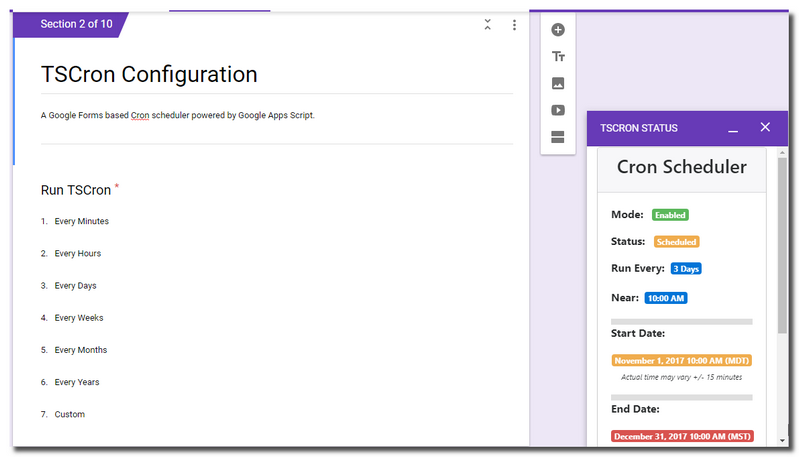

**TSCron** is a [Google Forms](https://www.google.com/forms/about/) based [Cron](https://en.wikipedia.org/wiki/Cron) scheduler powered by [Google Apps Script](https://www.google.com/script/start/).

Cron scheduling is available for:

* **Minutes**
* **Hours**
* **Days**
* **Weeks**
* **Months**
* **Years**
* **Custom date/time** *(runs once)*


Potential uses for TSCron:

* Send a [Google Docs](https://www.google.com/docs/about/) newsletter to clients on the `1st of every month`
* Populate a [Google Sheet](https://www.google.com/sheets/about/) with [Google Analytics](https://analytics.google.com/) data  `every 4 weeks`
* Email event attendees a link to [Google Slides](https://www.google.com/slides/about/) `1 hour after` the presentation
* Notify warehouse managers of new regulations `every 3 months on the 1st of the month`
* Send an email to a colleague `every 3 days`
* Send yourself a list of goals every `January 1st`
* Add new todos to a [Trello](https://trello.com/) board every `Sunday at 9:00 PM`
* Send invoices to customers on the `"last day" of every month`
* Post a message to a [Slack](https://slack.com/) channel `daily at 8:00 AM`
* Automatically create a Sales Forecast presentation with [Google Slides](https://www.google.com/slides/about/) and share it with your manager `every 6 months`
* Send school activity updates to parents `every Monday at 8:00 AM`
* Run a backend [microservice](https://en.wikipedia.org/wiki/Microservices) `every 3 hours`
* ...


---

## How It Works

A submission to a **TSCron** enabled Google Form initiates a **new [cron](https://en.wikipedia.org/wiki/Cron) job** *(any previously scheduled cron job is removed)*.

Each form submission contains responses for both:

* pre-existing **TSCron configuration form elements** *(i.e. cron interval configuration, start date and optional end date)*

* any **user defined form elements** which are needed to implement the cron job

TSCron uses the configuration to **"schedule"** the new cron job at the selected *start date/time* and to **"reschedule"** the cron job at the desired cron interval.  If an *optional* **end date** is specified, TSCron will stop the cron job at that date/time.

*NOTE: Actual start, end and cron execution times may [vary +/- 15 minutes](https://developers.google.com/apps-script/reference/script/clock-trigger-builder) from the original selected dates/times.*

The **form owner** *(or a form collaborator)* **implements the cron job**  in a provided `cronJob()` function using [Google Apps Script](https://www.google.com/script/start/). *(TSCron executes the implemented `cronJob()` function on the start date/time and on each repeating cron interval.)*

Cron scheduling occurs in the **form owner's default time zone** and takes into account:

* *short months (e.g. Feburary, April, June, September, November)*
* *leap years*
* *daylight savings time*

---


## Getting Started

#### 1) Install TSCron in Google Drive.

* Login to [Google Drive](https://drive.google.com/).

* Access the **[TSCron form](https://techstreams.page.link/TSCron)**.

* Click the ***Use Template*** button. This will copy the form to Google Drive.

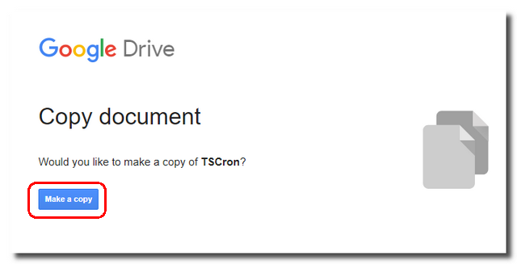

<br>

#### 2) Add any *user defined* form elements needed to implement the `cronJob()` function  


Locate and open the newly copied TSCron form and add any ***optional user defined*** form elements needed to implement the `cronJob()` function.  

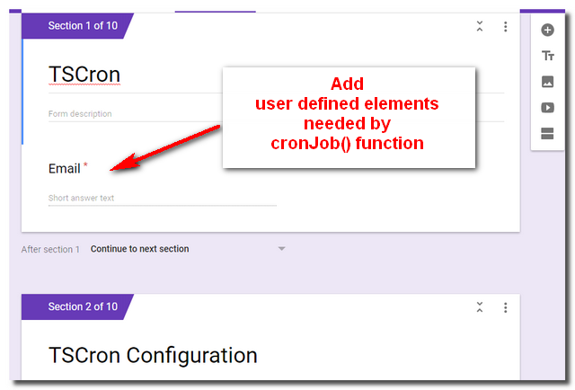

Be sure to add these optional form elements to form section(s) **BEFORE** the pre-existing TSCron configuration form elements.  

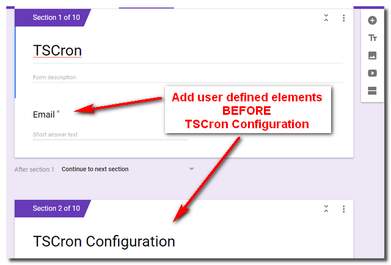

Any form submission responses for **user defined form elements** will be passed to the `cronJob()` function as an **array of [ItemResponses](https://developers.google.com/apps-script/reference/forms/item-response) each time** the cron job executes.

Be sure to set the ***Continue to next section*** option on the TSCron ***form section preceding*** the pre-existing TSCron configuration section.

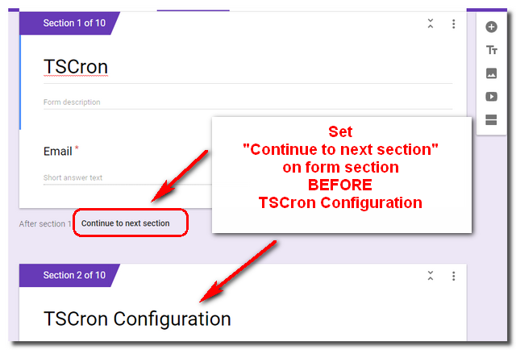


**IMPORTANT:**

* **Do not add, delete or modify** any form element or form section ***ON OR AFTER*** the pre-existing TSCron configuration form elements or the cron scheduler will cease to function properly.

* **Do not add any user defined elements** with the title `Run TSCron`.

<br>

#### 3) Implement the `cronJob()` function


Open the TSCron form's script editor.

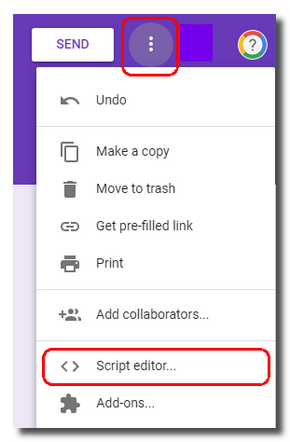

Implement the `cronJob()` function in the supplied `Code.gs` file using [Google Apps Script](https://www.google.com/script/start/).  *This file can be found within the TSCron form's Script Editor.*

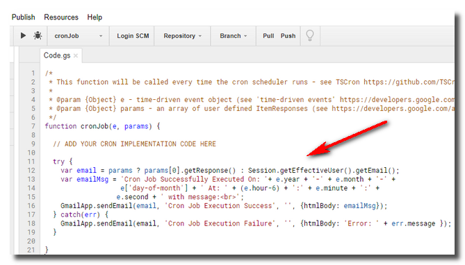

The `cronJob()` function will be called ***each time*** the cron job executes *(i.e. first on the cron start date/time and then on each repeating cron interval)* and will be passed **two parameters**:

* **e** - time-driven event object which contains information for the current cron execution *(see 'time-driven events' in the [Google Apps Script documentation](https://developers.google.com/apps-script/guides/triggers/events) for more information)*.  The event object is represented in [Coordinated Universal Time (UTC)](https://en.wikipedia.org/wiki/Coordinated_Universal_Time).

* **params** - an array of any ***user defined [ItemResponses](https://developers.google.com/apps-script/reference/forms/item-response)*** for the form elements defined in [Step #2](https://github.com/techstreams/TSCron#2-add-any-user-defined-form-elements-needed-to-implement-the-cronjob-function)  *(NOTE: If no user defined form elements exist this parameter will be `null`)*

Best implementation practices:

* Test for a `null` value in the passed `params` function parameter

* Use the [Lock Service](https://developers.google.com/apps-script/reference/lock/lock-service) to prevent any concurrent access to sections of code within the `cronJob()` function which might modify a shared resource.  This is particularly important when implementing longer running processes on a short `Minutes` cron interval where multiple `cronJob()` executions could occur simultaneously.

* Wrap the `cronJob()` implementation code in a [try/catch](https://developer.mozilla.org/en-US/docs/Web/JavaScript/Reference/Statements/try...catch) block and send an email on any error conditions

*NOTE: Both the [moment.js](https://github.com/moment/moment) and [moment-timezone.js](https://github.com/moment/moment-timezone) libraries used by TSCron are available for use within the `cronJob()` function.*


Here's an simple example implementation of a `cronJob()` function which is passed a user defined text form element [ItemResponse](https://developers.google.com/apps-script/reference/forms/item-response) which contains an email address.  The cron function sends a message to the specified email address *(or to the form owner if no email address is supplied through the form submission)*.

```js
function cronJob(e, params) {

  try {
    var email = params ? params[0].getResponse() : Session.getEffectiveUser().getEmail();
    var emailMsg = 'Cron Job Successfully Executed On: '+ e.year + '-' + e.month + '-' +
                   e['day-of-month'] + ' At: ' + (e.hour-6) + ':' + e.minute + ':' +
                  e.second + ' with message:<br>';
    GmailApp.sendEmail(email, 'Cron Job Execution Success', '', {htmlBody: emailMsg});
  } catch(err) {
    GmailApp.sendEmail(email, 'Cron Job Execution Failure', '', {htmlBody: 'Error: ' + err.message });
  }

}
```

<br>

**Important:**

When implementing the `cronJob()` function:

*  **Do not create** a "Script" [PropertiesService](https://developers.google.com/apps-script/reference/properties/properties-service) value with the key `tscron` or the cron scheduler will cease to function properly.

* **Do not create** any [form submit triggers](https://developers.google.com/apps-script/guides/triggers/#available_types_of_triggers) using the existing TSCron function `newTSCron`  or the cron scheduler will cease to function properly.

* **Do not create** any [time-based triggers](https://developers.google.com/apps-script/guides/triggers/#available_types_of_triggers) using the existing TSCron functions  `startTSCron`, `runTSCron` or `endTScron`  or the cron scheduler will cease to function properly.


<br>

#### 4) Run `Configure` option from the TSCron menu


Run the `TSCron > Configure` option from the form's add-on menu.

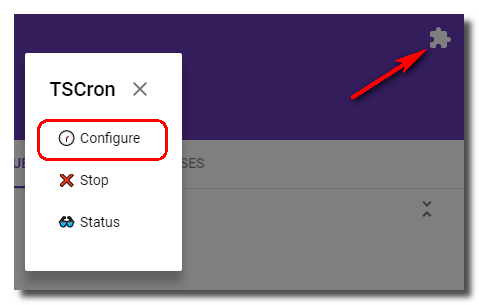

The first time the `Configure` option is run, the script **will prompt for authorization**. Complete the authorization process by following the Google authorization prompts.

**Important:**

* **Be sure to run the `Configure` option BEFORE** submitting to the form or the cron scheduler will not work.

* **If code requiring additional user authorization** is added to the `cronJob()` function, the authorization process must be repeated for TSCron to continue to operate correctly.  *Re-run the `Configure` menu option to re-authorize.*

<br>

#### 5) Start cron scheduler

Start the cron scheduler by submitting a response to the form.

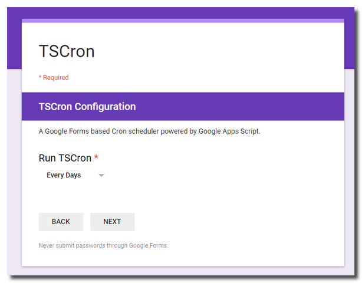


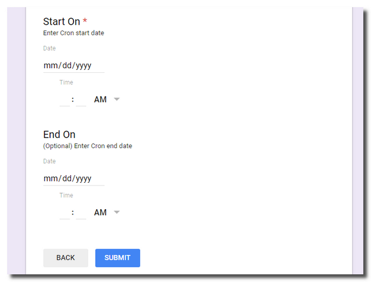


**Special Notes About "Month" and "Year" Cron Scheduling**

***Month Scheduling:***   

If a cron execution is scheduled in a month *(e.g. February, April, June, September, November)* which does not contain the original schedule date of the month *(e.g. 29th, 30th, 31st - determined from the cron start date)*, the cron will execute on the "last day" of that short month near the selected time.  

For months which contain the original schedule date, the cron will execute on that date of the month near the selected time.

*Example:  A cron job scheduled every `1` months starting on `January 31st` will next execute on `February 28th` (or `February 29th` if a leap year) and then again on `March 31st`, etc.*

If the cron job will be started on the "last day" of a short month *(e.g. February, April, June, September, November)* and you would like it to run on the "last day" of subsequent longer months *(e.g. January, March, May, July, August, October, December)* select `Yes` on the `Short Months?` configuration element.   For all other cases select `No`.


***Year Scheduling:***  

If the cron start date is `February 29th` during a leap year, the cron job will be scheduled to run on `February 28th` in non-leap years.

If the cron job is started on `February 28th` of a non-leap year and you would like it to run on `February 29th` in subsequent leap years, select `Yes` on the `Leap Years?` configuration element.  For all other cases select `No`.

**Important:**

* **When scheduling a new cron** the *start date/time* must be `at least 15+ minutes in the future` of the form submission and the *optional* *end date/time* must be scheduled `at least 1 hour after the start date/time`.  *NOTE: The cron job will not be scheduled  and an __error message email will be sent__ to the form owner if these conditions are not met.*

* **Actual cron execution times** may [vary +/- 15 minutes](https://developers.google.com/apps-script/reference/script/clock-trigger-builder) from the original schedule dates/times.

* **If a failure occurs during the initial or subsequent cron scheduling**, TSCron will be disabled and an error message email will be sent to the form owner.  *Restart the cron job by submitting another form request.*

* **Cron scheduling uses the Google Form owner's default time zone** *(determined by the form's associated Google Apps Script project properties - see `File -> Project properties -> Time zone` in the form's Script Editor)*.

* **If the TSCron default time zone is modified to a new time zone** the cron schedule ***will remain on the previous time zone***.   You must ***submit a new response*** to the form to get an updated cron schedule in the new time zone.

* **Do not delete form responses** while there is a running cron job or the cron scheduler will cease to function properly.

* **Do not delete any TSCron related [triggers](https://developers.google.com/apps-script/guides/triggers/#available_types_of_triggers)** from the form while there is a running cron job or the cron scheduler will cease to function properly.

* **Because cron schedule times can vary +/- 15 minutes**, the cron job ***could potentially execute after*** the original end date/time but before the cron job is stopped.

---

## Additional Options

### Stop Cron Scheduler

To stop the cron scheduler, run the `TSCron > Stop` option from the form's add-on menu.  *(This will remove all cron scheduling configuration for the current cron job)*

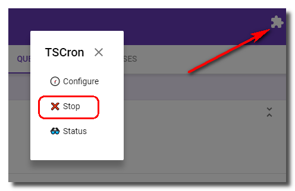

<br>

### Re-Start Cron Scheduler

To re-start the cron scheduler after an error condition or manual stop, submit a new response to the form.

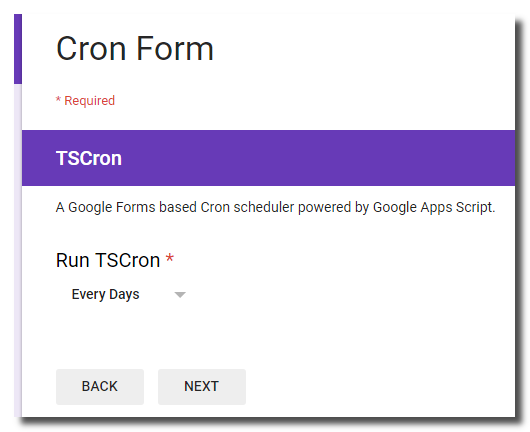

<br>

### View Cron Status

To view the cron scheduler status, select the `TSCron > Status` option from the form's add-on menu.

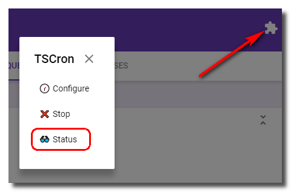

The TSCron status sidebar will open.

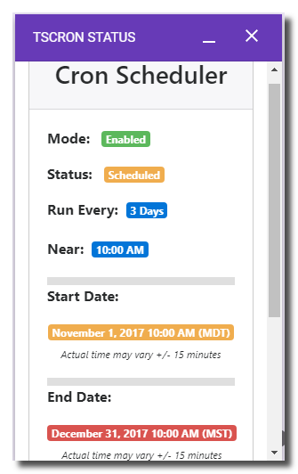

---


## FAQ

<details>
<summary><strong>Will the status sidebar automatically refresh?</strong></summary>
No.  Reopen the sidebar to see any changes to the cron status.
</details>
<br>
<details>
<summary><strong>I submitted a form response but TSCron did not start.  What should I do?</strong></summary>
<br>
If TSCron is not working properly, perform the following steps:<br><br>
<ul>
<li>Check email for an error message <em>(form owner)</em>.</li><br>
<li>Run the <code>TSCron > Configure</code> option and re-authorize the script in the event any new authorization scopes were added to the <code>cronJob()</code> function.</li><br>
<li>Ensure the TSCron configuration start and end dates are set to properly allow the cron interval to run.  <em>Start date should be 15+ minutes in future of the form submission and optional end date should be 1+ hours after the start date.</em></li>
</ul>
</details>
<br>
<details>
<summary><strong>Is TSCron Internationalized?</strong></summary>
No.  TSCron currently exists in English only.
</details>
<br>
<details>
<summary><strong>Why am I receiving a quota error when the cronJob() function runs?</strong></summary>
Google Apps Script is subject to daily quotas based upon the type of account accessing and running the script. See the "Quota Limits" tab on the <a href="https://docs.google.com/macros/dashboard" target="_blank">Google Apps Script Dashboard</a> for more information.
</details>
<br>
<details>
<summary><strong>How do I ask general questions about TSCron?</strong></summary>
For general questions, submit an issue through the <a href="https://github.com/techstreams/TSCron/issues" target="_blank">issue tracker</a>.
</details>
<br>
<details>
<summary><strong>How do I submit bug reports for TSCron?</strong></summary>
For bug reports, <a href="https://help.github.com/articles/fork-a-repo/" target="_blank">fork</a> this repository, create a test which demonstrates the problem following the procedures outlined in the "Tests" section below and submit a <a href="https://help.github.com/articles/creating-a-pull-request/" target="_blank">pull request</a>.  If possible, please submit a solution along with the pull request.
</details>

---

## Tests

TSCron unit tests can be found in [test.gs](/tests/test.gs).

To perform TSCron unit tests:

* Add the [test.gs](/tests/test.gs) file to the TSCron script editor.

* Install [QUnit for Google Apps Script](https://github.com/simula-innovation/qunit/tree/gas/gas) by adding the project library *(see the project documentation for proper install instructions)*.

* [Deploy the script](https://developers.google.com/apps-script/guides/web#deploying_a_script_as_a_web_app) as a web app *(execute script as self)*.

* Set the desired unit test configuration entry in the `testConfig` object to `true` *(see the [test.gs](/tests/test.gs) file for information on where to modify these values to enable tests)*.   NOTE: Some tests can take longer to run so best to run them individually.

* Access the deployed web app for test results.

---

## License

**TSCron License**

© Laura Taylor ([github.com/techstreams](https://github.com/techstreams)). Licensed under an MIT license.

Permission is hereby granted, free of charge, to any person obtaining a copy
of this software and associated documentation files (the "Software"), to deal
in the Software without restriction, including without limitation the rights
to use, copy, modify, merge, publish, distribute, sublicense, and/or sell
copies of the Software, and to permit persons to whom the Software is
furnished to do so, subject to the following conditions:

The above copyright notice and this permission notice shall be included in all
copies or substantial portions of the Software.

THE SOFTWARE IS PROVIDED "AS IS", WITHOUT WARRANTY OF ANY KIND, EXPRESS OR
IMPLIED, INCLUDING BUT NOT LIMITED TO THE WARRANTIES OF MERCHANTABILITY,
FITNESS FOR A PARTICULAR PURPOSE AND NONINFRINGEMENT. IN NO EVENT SHALL THE
AUTHORS OR COPYRIGHT HOLDERS BE LIABLE FOR ANY CLAIM, DAMAGES OR OTHER
LIABILITY, WHETHER IN AN ACTION OF CONTRACT, TORT OR OTHERWISE, ARISING FROM,
OUT OF OR IN CONNECTION WITH THE SOFTWARE OR THE USE OR OTHER DEALINGS IN THE
SOFTWARE.

**3rd Party Licenses**

| File | From | Copyright | License |
| :--: | :--: | :-------: | :-----: |
| [moment.gs](moment.gs) | [Github](https://github.com/moment/moment) | Copyright (c) JS Foundation and other contributors | [MIT License](https://github.com/moment/moment/blob/develop/LICENSE) |
| [moment-timezone.gs](moment-timezone.gs) | [Github](https://github.com/moment/moment-timezone) | Copyright (c) JS Foundation and other contributors | [MIT License](https://github.com/moment/moment-timezone/blob/develop/LICENSE) |
